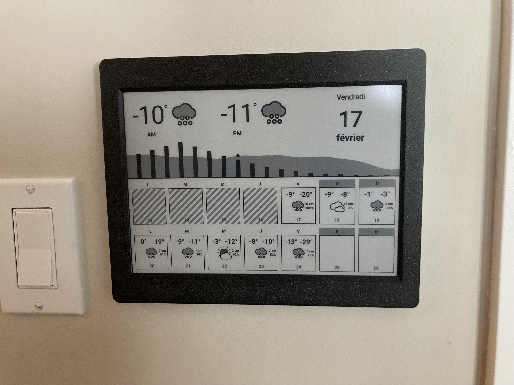

# Family Dashboard

Code for family dashboard. Always-on 10 inch e-ink screen, updated daily.



## Requirements

- Inkplate 10
- Docker server, network accessible from Inkplate device
- PirateWeather API key

## Useful Links

- [Pirate Weather Doc](http://docs.pirateweather.net/en/latest/)
- [Inkplate](https://inkplate.readthedocs.io/en/latest/)
- [Inkplate Arduino Setup](https://github.com/SolderedElectronics/Inkplate-Arduino-library#setting-up-inkplate-in-arduino-ide)
- [Inkplate 10 examples](https://github.com/SolderedElectronics/Inkplate-Arduino-library/tree/master/examples/Inkplate10)
- [node-html-to-image](https://github.com/frinyvonnick/node-html-to-image)

## Components

### Client: Inkplate 10 device

- This component fetch the current dashboard from the server and displays the info as-is on e-ink display.
- The device use wifi to access the home network.
- Client code is in client/ folder.
- Arduino C code. Use Arduino IDE to build and deploy to device.

### Dashboard server

- Generate the dashboard image on a schedule. Serve this image to the client device when requested.
- Server code is in server/ folder.
- It is a basic node.js application.
- The weather is fetched from an api. openweather and pirateweather are supported. See server/accessors/*weather
- The events data is fetched from an iCal url. See server/accessor/ical
- The dashboard image is generated using an html template. See server/accessors/template

## Development

### Client

Arduino IDE.

Dependencies:

- Inkplate arduino libraries.
- Inkplate board definition.

### Server

Environment variables:

```
PIRATEWEATHER_APIKEY=***
WEATHER_CACHE_DURATION_MINUTES=120
WEATHER_AM_HOUR=8
WEATHER_PM_HOUR=14
LAT=***
LON=***
ICAL_URL=https://p35-caldav.icloud.com/published/2/***
PORT=8080
```

Put those values in .ENV file to configure your server.

```bash
cd server
npm install
node .
```

Now, you can make changes to the template and see the result in a browser at [http://localhost:8080/generatePage](http://localhost:8080/generatePage).

I used NSSM to host the node app as a windows service on my home server box.

## Troubleshooting

### Arduino IDE

``` 
Compilation error: Error resolving FQBN: getting build properties for board Inkplate_Boards:esp32:Inkplate10: invalid option 'PSRAM'

Compilation error: Error resolving FQBN: getting build properties for board Inkplate_Boards:esp32:Inkplate10: invalid option 'CPUFreq'
```

1. Delete inkplate library
2. Delete inkplate board
3. Install inkplate board
4. Compile. Missing file error should happear.
5. Install inkplate library
6. Compile... it should work now.
